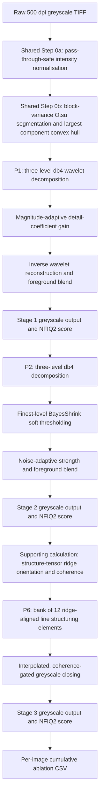

# Pipeline B report draft: wavelet and orientation-steered fingerprint enhancement

> Editorial status: This chapter is ready for integration into the group report. Section numbers, figure numbers and cross-references should be updated after insertion. The cross-pipeline comparison and hybrid-selection paragraphs must remain provisional until every pipeline has supplied its final cumulative ablation results.

## 1. Background and objectives

Fingerprint verification depends on the visibility and continuity of ridge-valley patterns. Noise, weak contrast and locally ambiguous ridge flow can reduce the reliability of orientation estimation and minutiae extraction. The selected project therefore addresses the assignment topic of a fingerprint enhancement system: a preprocessing pipeline intended to improve degraded or partial fingerprint images before matching or feature analysis.

The FVC2002 Set B data used in the evaluation contain four distinct subsets. DB1_B and DB2_B were acquired with optical sensors, DB3_B with a capacitive sensor, and DB4_B was produced by the SFinGe synthetic generator (Maio et al., 2002). Each subset contains 80 greyscale impressions, producing 320 images in total. Preliminary characterisation identified three shared problems for the comparative study: low global contrast, particularly in DB3_B; high random noise, also concentrated in DB3_B; and weak or inconsistent local ridge orientation, most evident in DB4_B and secondarily in DB3_B. Pipeline B addresses these problems with a multiresolution technique family that is distinct from the spatial, diffusion and frequency-domain techniques assigned to the other pipelines.

The following SMART objectives apply to Pipeline B:

1. Before coursework submission, implement three modular classical image-processing stages that address contrast, noise and ridge orientation while retaining an original-size, 8-bit greyscale output.
2. Before the final hybrid is selected, quantify the isolated cumulative contribution of every Pipeline B stage on all 320 FVC2002 Set B images using NFIQ 2.3.0.
3. Improve the paired mean NFIQ2 score over the raw baseline while maintaining a visually plausible ridge pattern without obvious cross-ridge strokes, block seams, background spill or binary-output substitution.
4. Produce reproducible per-image and aggregate result files that permit data-driven comparison with the corresponding P1, P2 and P6 techniques in Pipelines A, C and D.

## 2. Literature review

### 2.1 Multiresolution fingerprint enhancement

The discrete wavelet transform represents an image at multiple spatial scales through one approximation subband and horizontal, vertical and diagonal detail subbands. Mallat (1989) established the pyramidal multiresolution framework on which this decomposition is based. Unlike a single global high-pass operation, wavelet processing permits scale-selective modification: coarse structural detail can be strengthened without necessarily amplifying the finest noise-dominated coefficients.

Hsieh et al. (2003) applied wavelet-based multiresolution analysis to fingerprint enhancement and reported improved ridge clarity and continuity. Their method combines global texture information with local directional information. Pipeline B adopts the supported principle that fingerprint structure can be enhanced by modifying wavelet-domain information, but it does not claim to reproduce the complete Hsieh et al. algorithm. The implemented P1 stage instead preserves the approximation coefficients and applies a magnitude-adaptive gain to the detail coefficients. This distinction must be retained in the final report to avoid overstating methodological equivalence.

### 2.2 Wavelet shrinkage

Wavelet shrinkage suppresses coefficients that are more consistent with noise than useful signal. Donoho and Johnstone (1994) provided the statistical foundation for wavelet shrinkage, while Chang et al. (2000) introduced BayesShrink, an adaptive soft-threshold estimator calculated from each subband's observed variance and an estimate of noise variance. Soft thresholding reduces the magnitude of retained coefficients continuously, avoiding the discontinuity of hard thresholding.

The fingerprint application requires additional restraint because genuine ridge edges also contribute high-frequency energy. Pipeline B therefore thresholds only the finest decomposition level and adjusts the BayesShrink strength using an image-level random-noise estimate. Immerkær's (1996) 3 x 3 estimator was selected because it provides an efficient estimate of additive noise. The estimator is used only to modulate the strength of the same shrinkage technique; it is not treated as a fourth enhancement stage.

### 2.3 Orientation-guided ridge processing

Local ridge orientation is a central property of fingerprint enhancement. Hong et al. (1998) demonstrated an orientation- and frequency-adaptive fingerprint enhancement framework and showed that reliable local ridge measurements can improve ridge-valley clarity. Pipeline B uses the shared structure-tensor orientation estimator as a supporting calculation rather than a counted enhancement technique.

Milici et al. (2005) proposed directional morphological filtering for fingerprint enhancement using directional decomposition, morphology and composition. This work supports the use of orientation-specific structuring elements for ridge processing. Pipeline B adapts that principle to greyscale morphology: dark ridges are inverted, directionally closed, returned to the original polarity and blended according to local coherence. No binary image is passed to NFIQ2.

### 2.4 Comparison of relevant methods

| Source | Main approach | Main strength | Limitation relevant to this project | Relationship to Pipeline B |
|---|---|---|---|---|
| Mallat (1989) | Multiresolution wavelet decomposition | Separates image information by scale and orientation | General signal representation rather than a fingerprint-specific enhancement method | Mathematical basis for the three-level 2-D decomposition |
| Hsieh et al. (2003) | Wavelet-based fingerprint texture and directional recovery | Uses multiresolution information to improve ridge clarity and continuity | The complete published algorithm is more extensive than coefficient gain alone | Supports wavelet-domain fingerprint enhancement; not claimed as an exact reproduction |
| Donoho and Johnstone (1994) | Wavelet shrinkage | Establishes adaptive denoising through coefficient shrinkage | Not fingerprint-specific and does not protect ridge detail by itself | Statistical basis for coefficient shrinkage |
| Chang et al. (2000) | Subband-adaptive BayesShrink soft thresholding | Adjusts the threshold to estimated signal and noise variance | Strong shrinkage may remove genuine high-frequency fingerprint structure | Basis for P2, restricted to the finest level and noise-adapted |
| Immerkær (1996) | Fast 3 x 3 noise-variance estimation | Computationally inexpensive and suitable for continuous strength control | Thin lines and highly textured regions may be interpreted as noise | Controls P2 strength but is not a separate enhancement technique |
| Hong et al. (1998) | Local orientation/frequency estimation with adaptive fingerprint filtering | Explicitly models ridge flow and ridge frequency | Sensitive to inaccurate local estimates; the full Gabor method belongs to another pipeline | Supports the shared orientation-field calculation |
| Milici et al. (2005) | Directional morphological fingerprint filtering | Connects structures along estimated ridge directions | Hard directional selection can introduce seams or incorrect connections | Basis for interpolated, coherence-gated P6 morphology |
| National Institute of Standards and Technology [NIST] (2024) | NFIQ2 random-forest quality model | Standardised 0-100 measure linked to expected recognition utility for 500 ppi fingerprints | A quality score is not a direct matcher accuracy or visual-quality measurement | Primary quantitative evaluation metric |

## 3. Methodology

### 3.1 Processing flow

The flow in Figure B1 is cumulative. Each stage receives the output of the preceding stage. Intermediate outputs remain independently accessible so that the marginal NFIQ2 contribution of each counted technique can be measured.

**Figure B1.** Pipeline B cumulative processing and evaluation flow. Normalisation, segmentation and orientation estimation are shared supporting operations and are not counted as additional P1, P2 or P6 techniques.

### 3.2 Shared preprocessing

Every pipeline receives the same shared preprocessing to preserve fair experimental conditions. The final normalisation default uses a target standard deviation floor of 10 rather than forcing every image to a fixed contrast. Images already at or above the target variance pass through unchanged; lower-variance images are rescaled using their own mean and a headroom-aware gain cap. This prevents naturally high-contrast images from being compressed before the counted techniques begin.

Foreground segmentation is calculated from variance in 16 x 16 blocks. Otsu's (1979) threshold separates the high-variance fingerprint region from smoother background. The convex hull of the largest connected foreground component fills incorrectly excluded core regions while limiting the influence of isolated background components. The resulting block mask gates the three enhancement stages but is not supplied to NFIQ2 as an image.

### 3.3 P1: wavelet detail-coefficient contrast enhancement

The normalised image is decomposed using a three-level, separable 2-D Daubechies-4 transform with symmetric boundary handling. Approximation coefficients are retained unchanged. For a detail coefficient with magnitude \(|c|\), a reliability term is calculated as

\[
r(c)=\frac{|c|}{|c|+F},
\]

where \(F\) is the 25th percentile of non-zero magnitudes in the subband. The applied scale is

\[
s(c)=1+(g-1)r(c).
\]

The gain \(g\) is interpolated from 1.60 at the coarsest detail level to 1.00 at the finest level. Stronger structural coefficients therefore receive more gain, while weak coefficients remain closer to their original magnitude. Leaving the finest gain at 1.00 limits premature amplification of the scale most likely to contain random noise. After inverse reconstruction, only the detail increment is blended into the segmented foreground.

### 3.4 P2: noise-adaptive BayesShrink denoising

Stage 1 is decomposed with the same wavelet and level. The noise standard deviation is estimated from the median absolute deviation of foreground coefficients in the finest diagonal-detail subband:

\[
\hat{\sigma}_{n}=\frac{\operatorname{median}(|c_D|)}{0.6745}.
\]

For each finest-level detail subband, the estimated signal deviation is

\[
\hat{\sigma}_{x}=\sqrt{\max(\sigma_y^2-\hat{\sigma}_{n}^2,0)},
\]

and the BayesShrink threshold is

\[
T_B=\frac{\hat{\sigma}_{n}^2}{\hat{\sigma}_{x}}.
\]

The threshold is applied using soft shrinkage. To avoid treating strong clean ridge detail as random noise, the base threshold is multiplied by

\[
a=\operatorname{clip}\left[\left(\frac{\hat{\sigma}_{I}}{5}\right)^4,0.10,1.00\right],
\]

where \(\hat{\sigma}_{I}\) is Immerkær's image-level noise estimate. The non-zero lower bound keeps P2 active on clean images, while the fourth-power mapping strongly reduces its effect outside noisy cases. Only the finest level is thresholded. The reconstructed denoising increment is foreground-gated, and Stage 2 remains greyscale.

### 3.5 P6: orientation-steered greyscale morphology

The shared structure tensor estimates ridge direction and coherence from Stage 2 in 16 x 16 blocks. Angles are represented in doubled-angle form so that ridge directions separated by 180 degrees are treated as equivalent. Both \(\cos(2\theta)\) and \(\sin(2\theta)\) are interpolated to pixel resolution before the pixel-level angle is recovered.

Because fingerprint ridges are dark, the image is inverted before greyscale closing. A bank of 12 one-pixel-wide line kernels, each seven pixels long, covers the half-circle of unique ridge orientations. The closing responses of the two neighbouring directions are linearly interpolated at every pixel. This avoids hard angular changes at block boundaries and at the equivalent -90/90-degree boundary.

Local coherence is converted into confidence using

\[
q=\operatorname{clip}\left(\frac{C-0.20}{1-0.20},0,1\right).
\]

Only foreground pixels with reliable orientation receive the directional change. Ridge darkening is capped at 16 grey levels before multiplication by a strength of 0.50. The output is clipped to 0-255 and returned as an 8-bit greyscale image. This design prevents binary morphology from being mistaken for the final quality-scoring input.

### 3.6 Locked parameters

| Stage | Parameter | Locked value |
|---|---|---:|
| Shared Step 0 | Normalisation target standard-deviation floor | 10 |
| Shared Step 0 | Segmentation block size | 16 x 16 pixels |
| P1 | Wavelet and decomposition level | db4, level 3 |
| P1 | Coarsest/final detail gain | 1.60 / 1.00 |
| P1 | Coefficient reliability percentile | 25th |
| P2 | Threshold | BayesShrink, soft |
| P2 | Denoised levels | Finest 1 level |
| P2 | Noise-strength rule | clip[(sigma/5)^4, 0.10, 1.00] |
| P6 | Line-kernel length | 7 pixels |
| P6 | Orientation bins | 12 |
| P6 | Strength | 0.50 |
| P6 | Coherence floor/power | 0.20 / 1.00 |
| P6 | Maximum pre-strength darkening | 16 grey levels |

### 3.7 Pilot selection and locked full evaluation

A fixed 16-image pilot contained four impressions from each database. P1 compared 21 bounded configurations, P2 compared 28 and P6 compared 30. Candidate selection considered mean NFIQ2 gain, number of regressions, worst regression and visual plausibility. The highest-mean candidate was not automatically selected when it carried greater downside risk. P1, P2 and P6 were locked sequentially, and every later pilot retained the earlier defaults.

After the three defaults were fixed, all 320 images were processed without retrospective tuning. Four NFIQ2 measurements were attempted for each image: Raw, Stage 1, Stage 2 and Stage 3. The marginal contributions were defined as

\[
\Delta P1=S_1-R, \quad \Delta P2=S_2-S_1, \quad \Delta P6=S_3-S_2,
\]

with total change \(\Delta_{final}=S_3-R\). NFIQ 2.3.0 was used because it provides a standardised 0-100 fingerprint utility score for 500 ppi images (National Institute of Standards and Technology [NIST], 2024). The manifest was validated as 80 images per subset before scoring. A checkpoint was saved after every image, score ranges and deltas were checked, and Stage 3 was verified as pixel-identical to the public `enhance()` output for all 320 images.

## 4. Results

### 4.1 Overall cumulative results

NFIQ2 returned a raw score for 319 of 320 images. On this paired set, mean quality increased from 41.527 to 48.201, giving a mean total improvement of 6.674 points. The median improvement was 6 points. A total of 237 images improved, 73 regressed and nine were unchanged. Stage 1 was the largest mean contributor, followed by P6 and P2.

| Increment | Valid n | Mean change | Median | Approx. 95% CI for mean | Improved | Regressed | Unchanged |
|---|---:|---:|---:|---:|---:|---:|---:|
| P1: Stage 1 - Raw | 319 | +4.931 | +4.0 | [+4.039, +5.823] | 218 | 79 | 22 |
| P2: Stage 2 - Stage 1 | 320 | +0.706 | 0.0 | [+0.314, +1.098] | 124 | 88 | 108 |
| P6: Stage 3 - Stage 2 | 320 | +1.034 | +1.0 | [+0.503, +1.566] | 175 | 121 | 24 |
| Total: Stage 3 - Raw | 319 | +6.674 | +6.0 | [+5.686, +7.662] | 237 | 73 | 9 |

The confidence intervals are normal-approximation descriptive intervals for the mean, not a substitute for independent-dataset validation. The P1 and total rows contain 319 rather than 320 paired observations because one raw image was rejected by NFIQ2.

### 4.2 Results by database

| Subset | Paired n | Mean Raw | Mean Stage 3 | Mean total change | Improved | Regressed | Unchanged |
|---|---:|---:|---:|---:|---:|---:|---:|
| DB1_B | 80 | 62.038 | 63.850 | +1.813 | 46 | 31 | 3 |
| DB2_B | 80 | 50.450 | 57.838 | +7.388 | 61 | 17 | 2 |
| DB3_B | 79 | 24.646 | 36.063 | +11.418 | 69 | 9 | 1 |
| DB4_B | 80 | 28.763 | 34.900 | +6.138 | 61 | 16 | 3 |
| Overall | 319 | 41.527 | 48.201 | +6.674 | 237 | 73 | 9 |

DB3_B received the largest total benefit, followed by DB2_B and DB4_B. DB1_B remained positive but showed the smallest gain and the highest regression count.

### 4.3 Per-stage behaviour by database

| Subset | Mean delta P1 | Mean delta P2 | Mean delta P6 |
|---|---:|---:|---:|
| DB1_B | +1.838 | +0.513 | -0.538 |
| DB2_B | +6.450 | -0.025 | +0.963 |
| DB3_B | +6.405* | +2.463 | +2.500 |
| DB4_B | +5.050 | -0.125 | +1.213 |
| Overall | +4.931* | +0.706 | +1.034 |

*P1 requires a Raw score and therefore uses 79 DB3_B images and 319 images overall. P2 and P6 use all 320 stage-to-stage comparisons.

### 4.4 NFIQ2 exception

NFIQ2 rejected the raw image `DB3_B/110_5.tif` with `FRFXLL_ERR_FB_TOO_SMALL_AREA`, indicating insufficient fingerprint area for creation of the feature set. The same raw failure is present in Pipeline C's independently produced result file. Pipeline B nevertheless generated valid Stage 1, Stage 2 and Stage 3 scores of 14, 18 and 15. The raw score and any delta that requires it were left blank, and the official error text was retained. No value was imputed.

## 5. Discussion

### 5.1 Contribution of P1

P1 produced the largest average marginal gain: +4.931 points across 319 paired images. Positive mean changes occurred in every subset. The strongest increases appeared in DB2_B (+6.450) and DB3_B (+6.405), while DB1_B increased by only +1.838. This pattern supports the use of multiresolution detail enhancement for lower-quality inputs but also indicates that a fixed enhancement operation offers less benefit when ridge contrast is already high.

The design decision to leave the approximation coefficients unchanged is important. The improvement cannot be attributed to a second global intensity normalisation; it results from spatial-frequency detail modification and foreground blending. The 1.00 finest-scale gain also limits amplification of DB3_B's known random noise before P2.

### 5.2 Contribution of P2

P2 produced a smaller overall mean gain of +0.706. Its effect was concentrated in DB3_B, where the marginal mean was +2.463 and 51 of 80 images improved. DB2_B and DB4_B were approximately neutral, with means of -0.025 and -0.125. In DB2_B, 73 of 80 scores were unchanged. This is consistent with the intended noise-adaptive control: cleaner images receive only the minimum threshold factor, while the noisier capacitive subset receives stronger shrinkage.

The small aggregate P2 gain should not be presented as evidence that denoising was unnecessary. Uniform full-strength shrinkage caused larger regressions during pilot testing because ridge edges were removed together with noise. The locked rule deliberately accepts near-neutral behaviour on cleaner images to protect structure. Nevertheless, the result also means that P2 should compete on measured marginal contribution, rather than being assumed to enter the hybrid pipeline automatically.

### 5.3 Contribution of P6

P6 added +1.034 points overall and improved 175 of 320 stage-to-stage comparisons. Its strongest mean contribution appeared in DB3_B (+2.500), followed by DB4_B (+1.213). This is consistent with the lower orientation coherence previously measured in these subsets. The DB1_B mean was -0.538, showing that directional closing can alter already-clear ridges in ways that reduce NFIQ2 even when visual continuity remains plausible.

Interpolation between adjacent directional responses and coherence gating prevented obvious hard direction boundaries in the visual audit. The audit covered the eight worst final regressions and eight fixed-seed random samples. No cross-ridge merging, wrong-direction strokes, block seams, background spill or greyscale clipping was observed. Visual acceptability does not eliminate score regression; it instead suggests that NFIQ2 is responding to subtler feature changes than the listed gross artefacts.

### 5.4 Dependence on raw image quality

Raw NFIQ2 and final change had a moderate negative relationship (Pearson correlation = -0.408; Spearman correlation = -0.378). The highest raw-quality quartile had a mean improvement of only +0.636 and 49.4% of its images improved. In contrast, the lowest raw-quality quartile improved by +10.325 on average and 82.5% improved. Pipeline B therefore behaves mainly as a restoration method for degraded images rather than as a universal improvement for already strong samples.

The worst total regression was DB1_B/101_6.tif, which decreased from 86 to 66 (-20). DB1_B/102_6.tif decreased from 87 to 73 (-14), and DB2_B/104_3.tif decreased from 82 to 68 (-14). Their high starting scores support the observed negative quality-gain relationship. This interpretation is correlational: the data show an association between high initial quality and lower benefit but do not establish a single causal mechanism inside NFIQ2.

### 5.5 Relevance to hybrid selection

The cumulative design provides one comparable marginal value for each problem position. For Pipeline B, P1 is the strongest candidate based on mean contribution, P6 is positive but more variable, and P2 is deliberately conservative outside DB3_B. These results must be compared with the matching P1, P2 and P6 increments from Pipelines A, C and D. The final hybrid must use one fixed technique at each position across the complete dataset. Per-image technique switching would represent a different experimental design and must not be inferred from the quality-quartile analysis.

## 6. Limitations

1. NFIQ2 estimates fingerprint utility but does not directly measure verification accuracy. No matcher-level false-match rate, false-non-match rate or equal-error rate was measured.
2. Parameter selection used a fixed 16-image pilot. Although the full dataset was reserved for locked validation, the pilot may not represent every within-subset degradation pattern.
3. The evidence comes from FVC2002 Set B only. Sensor types, image sizes and degradation distributions may differ in current operational datasets.
4. The P1 gain is fixed across images. High-quality samples show less benefit and a greater regression risk, although retrospective full-dataset tuning was intentionally avoided.
5. Immerkær's estimator can interpret thin texture as noise. Noise adaptation reduces this risk but cannot eliminate it completely in fingerprint imagery.
6. Orientation-steered closing may alter ridge width or local minutiae even when no gross visual artefact is visible. A downstream minutiae-consistency or matcher evaluation is required before operational use.
7. One raw image was unscorable by NFIQ2. Pairwise P1 and total statistics therefore use 319 images, while P2 and P6 stage comparisons use 320.
8. The reported confidence intervals describe sampling variability within this dataset and do not prove generalisation to an independent population.

## 7. Conclusion

All four Pipeline B objectives were achieved. First, three modular classical techniques were implemented with an original-size, 8-bit greyscale output. Second, their cumulative contributions were measured across the complete 320-image manifest, with transparent handling of one raw NFIQ2 rejection. Third, the paired mean NFIQ2 score increased from 41.527 to 48.201, a gain of 6.674 points; 237 of 319 paired images improved, and the visual audit found none of the predefined gross artefacts. Fourth, reproducible per-image, summary and regression CSV files were produced for later hybrid selection.

The results also define the boundary of the method. The largest gains occurred on DB3_B and on low-quality images, while high-quality samples benefited less and sometimes regressed. P1 supplied most of the average improvement, P2 was selectively beneficial on the noisy DB3_B subset, and P6 was most useful where ridge orientation was less reliable. Consequently, Pipeline B should be treated as a strong restoration pipeline for degraded fingerprints, while the final hybrid decision should remain data-driven and should incorporate the corresponding cumulative evidence from all four pipelines.

## 8. Recommended figures and integration items

The following items should be included when the group report is assembled:

1. Figure B1, redrawn as a native Word flowchart if Mermaid rendering is unavailable.
2. A four-panel Raw/Stage 1/Stage 2/Stage 3 example from DB3_B showing a clear positive progression.
3. A second four-panel example from the regression audit, preferably DB1_B/101_6.tif, to support the critical discussion rather than displaying only successful cases.
4. A grouped bar chart of mean P1, P2 and P6 marginal contribution by database.
5. A scatter plot of Raw NFIQ2 against total change with the Pearson correlation reported in the caption.
6. The final group-level table comparing the same three stage positions across Pipelines A-D, followed by the fixed hybrid selection.
7. An AI usage disclosure entry describing the use of an AI assistant for code structuring, debugging, statistical summarisation and language refinement, together with the checks performed against source code, CSV results, primary literature and the assignment rubric.

## References

Chang, S. G., Yu, B., & Vetterli, M. (2000). Adaptive wavelet thresholding for image denoising and compression. *IEEE Transactions on Image Processing, 9*(9), 1532-1546. https://doi.org/10.1109/83.862633

Donoho, D. L., & Johnstone, I. M. (1994). Ideal spatial adaptation by wavelet shrinkage. *Biometrika, 81*(3), 425-455. https://doi.org/10.1093/biomet/81.3.425

Hong, L., Wan, Y., & Jain, A. K. (1998). Fingerprint image enhancement: Algorithm and performance evaluation. *IEEE Transactions on Pattern Analysis and Machine Intelligence, 20*(8), 777-789. https://doi.org/10.1109/34.709565

Hsieh, C.-T., Lai, E., & Wang, Y.-C. (2003). An effective algorithm for fingerprint image enhancement based on wavelet transform. *Pattern Recognition, 36*(2), 303-312. https://doi.org/10.1016/S0031-3203(02)00032-8

Immerkær, J. (1996). Fast noise variance estimation. *Computer Vision and Image Understanding, 64*(2), 300-302. https://doi.org/10.1006/cviu.1996.0060

Maio, D., Maltoni, D., Cappelli, R., Wayman, J. L., & Jain, A. K. (2002). FVC2002: Second fingerprint verification competition. In *Proceedings of the 16th International Conference on Pattern Recognition* (Vol. 3, pp. 811-814). IEEE. https://doi.org/10.1109/ICPR.2002.1048144

Mallat, S. G. (1989). A theory for multiresolution signal decomposition: The wavelet representation. *IEEE Transactions on Pattern Analysis and Machine Intelligence, 11*(7), 674-693. https://doi.org/10.1109/34.192463

Milici, G., Raia, G., Vitabile, S., & Sorbello, F. (2005). Fingerprint image enhancement using directional morphological filter. In *EUROCON 2005 - The International Conference on Computer as a Tool* (pp. 967-970). IEEE. https://doi.org/10.1109/EURCON.2005.1630108

National Institute of Standards and Technology. (2024). *NIST Fingerprint Image Quality 2* (Version 2.3.0) [Computer software]. https://pages.nist.gov/NFIQ2/

Otsu, N. (1979). A threshold selection method from gray-level histograms. *IEEE Transactions on Systems, Man, and Cybernetics, 9*(1), 62-66. https://doi.org/10.1109/TSMC.1979.4310076

## Appendix A. AI usage disclosure draft

The official disclosure form supplied with the documentation template remains the required submission format. The following record can be transferred into that form.

| Item | Disclosure |
|---|---|
| Tool | OpenAI Codex, used as an AI-supported coding, research and writing assistant |
| Prompt summary 1 | Explain the fingerprint enhancement assignment and identify Member B's pipeline responsibilities from the specification and team instructions |
| Prompt summary 2 | Implement and validate the three Pipeline B stages sequentially: wavelet detail contrast, wavelet shrinkage denoising and orientation-steered morphology |
| Prompt summary 3 | Run the locked 320-image cumulative NFIQ2 evaluation, retain final CSV results and diagnose any scoring failures without fabricating values |
| Prompt summary 4 | Draft a UK-English Pipeline B report section aligned with the marking rubric, final result CSVs and primary literature |
| AI-supported outputs | Code structure, debugging suggestions, pilot-test scripts, cumulative evaluation tooling, statistical summaries and report-language refinement |
| Human/accountability checks | Source code was separated into independently callable stages; unit tests checked image contracts and directional morphology; all 320 Stage 3 images were compared pixel-by-pixel with `enhance()`; dataset counts, score ranges and CSV deltas were validated; worst-regression and random images were visually audited; bibliographic details were checked against publisher, IEEE, NIST or institutional records; no missing NFIQ2 score was imputed |
| Responsibility statement | Final responsibility for the accuracy, interpretation, citations and submitted wording remains with the student team |
